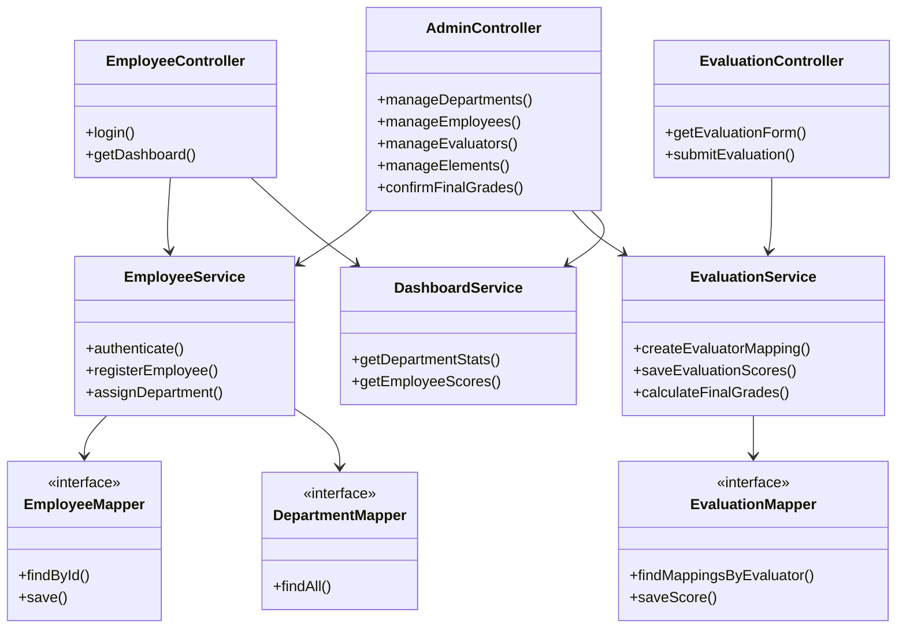

# Class Diagram (Domain Model & Backend Layer)

```mermaid
classDiagram
    class EmployeeController {
        +login()
        +getDashboard()
    }
    
    class AdminController {
        +manageDepartments()
        +manageEmployees()
        +manageEvaluators()
        +manageElements()
        +confirmFinalGrades()
    }

    class EvaluationController {
        +getEvaluationForm()
        +submitEvaluation()
    }

    class EmployeeService {
        +authenticate()
        +registerEmployee()
        +assignDepartment()
    }

    class EvaluationService {
        +createEvaluatorMapping()
        +saveEvaluationScores()
        +calculateFinalGrades()
    }

    class DashboardService {
        +getDepartmentStats()
        +getEmployeeScores()
    }
    
    class EmployeeMapper {
        <<interface>>
        +findById()
        +save()
    }

    class EvaluationMapper {
        <<interface>>
        +findMappingsByEvaluator()
        +saveScore()
    }

    class DepartmentMapper {
        <<interface>>
        +findAll()
    }

    EmployeeController --> EmployeeService
    AdminController --> EmployeeService
    AdminController --> EvaluationService
    EvaluationController --> EvaluationService
    EmployeeController --> DashboardService
    AdminController --> DashboardService

    EmployeeService --> EmployeeMapper
    EvaluationService --> EvaluationMapper
    EmployeeService --> DepartmentMapper
```
