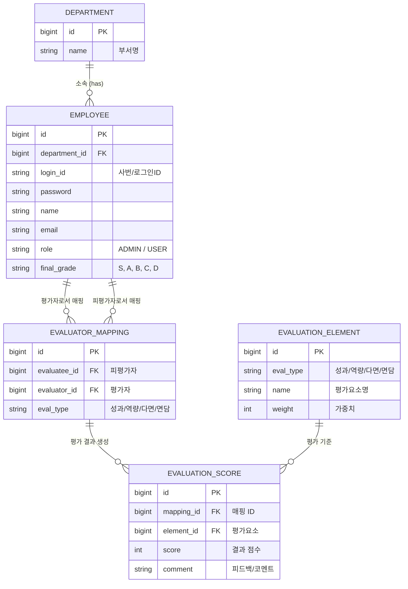

# Entity Relationship Diagram (ERD)

## 엔티티 및 주요 속성 설명
- **DEPARTMENT (부서)**: 조직도를 구성하는 단위를 관리합니다.
- **EMPLOYEE (사원)**: 시스템의 사용자. 관리자와 일반 사원으로 구분되며, 자신이 속한 부서 정보와 최종 평가 등급을 가집니다.
- **EVALUATION_ELEMENT (평가요소)**: 성과, 역량, 다면, 면담 등 각 평가 유형별로 어떤 항목을 평가할지, 가중치는 얼마인지 정의합니다.
- **EVALUATOR_MAPPING (평가자 매핑)**: 특정 피평가자를 어떤 평가자가 어떤 유형(성과, 역량 등)으로 평가할지 권한과 관계를 정의합니다.
- **EVALUATION_SCORE (평가결과)**: 평가자가 피평가자를 평가한 세부 항목별 점수와 코멘트를 저장합니다.
