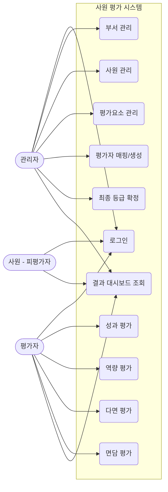

# Use Case 명세서

## Use Case Diagram

## Actor 설명
- **관리자 (Admin)**: 시스템의 전반적인 관리(부서, 사원, 평가요소, 평가자 지정 등)를 담당. 최종 평가 등급을 확인하고 확정할 권한을 가짐.
- **평가자 (Evaluator)**: 권한이 부여된 사원으로, 배정된 피평가자의 성과/역량/다면/면담 평가를 수행함.
- **사원 (Employee)**: 시스템에 접속해 자신의 최종 등급 및 평가 결과를 확인하는 일반 사용자.

## Use Case 상세
1. **로그인**: 사번과 비밀번호를 이용해 시스템에 접속. 권한(Role)에 따라 메뉴가 다르게 노출됨.
2. **부서 관리**: 조직도 기반으로 부서 정보를 등록, 수정, 삭제, 조회함.
3. **사원 관리**: 신규 사원 등록, 소속 부서 할당, 기초 데이터 및 권한 설정.
4. **평가요소 관리**: 성과, 역량, 다면, 면담 평가 시 사용할 항목과 각 항목의 가중치를 설정함.
5. **평가자 매핑(생성)**: 특정 사원(피평가자)을 평가할 평가자를 유형별로 지정.
6. **성과 평가 / 역량 평가 / 다면 평가 / 면담 평가**: 평가자가 자신에게 할당된 피평가자를 대상으로 설정된 기준(평가요소)에 따라 점수와 코멘트를 입력.
7. **최종 등급 확정**: 모든 평가 점수가 집계된 후, 관리자가 조직별/개인별 점수 분포를 바탕으로 S/A/B/C/D 등의 최종 등급을 확정함.
8. **결과 시각화 조회**: 대시보드 페이지. 부서별 등급 분포도와 개인별 평가 점수 상세 현황을 차트로 보여줌.
